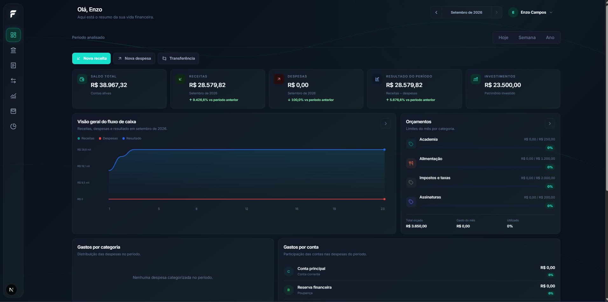
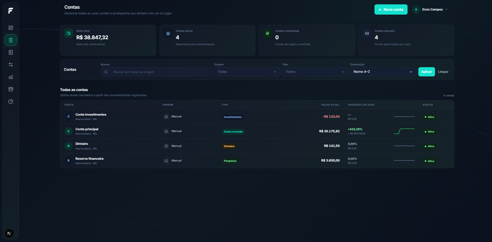
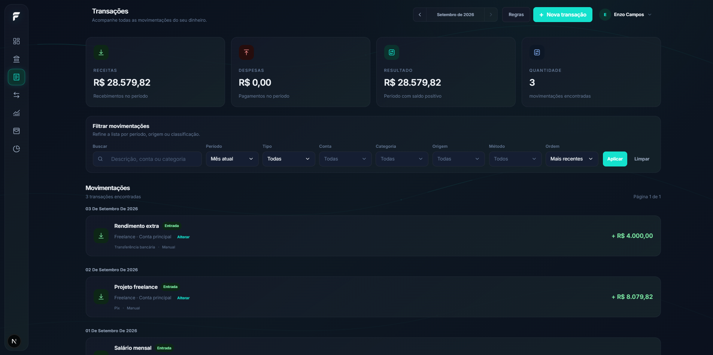
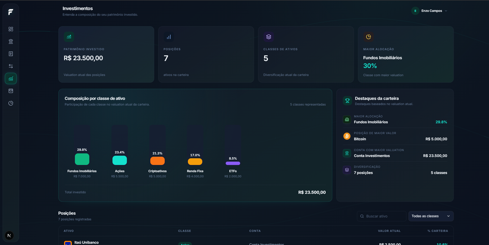
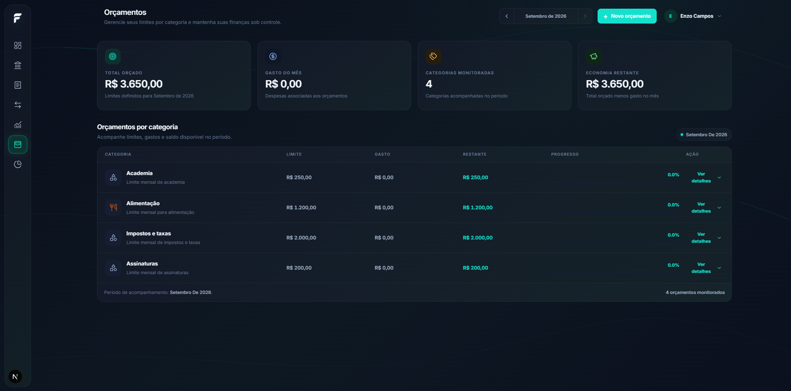
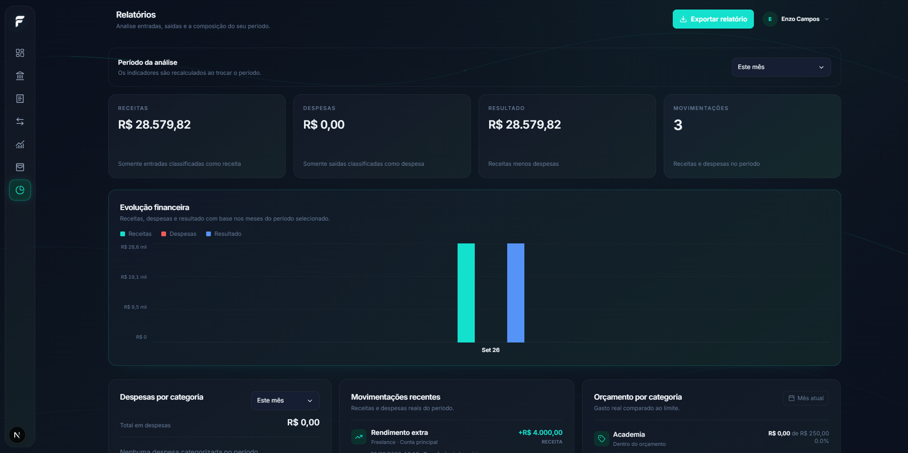

# Finora

**Controle. Planeje. Evolua.**

Aplicação full-stack de controle financeiro pessoal desenvolvida com **Next.js, React, TypeScript, PostgreSQL e Prisma**, com arquitetura preparada para múltiplas instituições financeiras, transações sincronizadas, categorização automática e evolução para integrações financeiras reais.

`Next.js 15` · `React 19` · `TypeScript` · `PostgreSQL 16` · `Prisma 6` · `Auth.js` · `LLMs`

> 🚧 **Em desenvolvimento ativo.** Este é o portfólio técnico público do Finora. O código-fonte principal permanece em repositório privado.

---

## Interface

O Finora possui uma interface própria inspirada em produtos financeiros modernos, com foco em clareza, hierarquia visual, consistência e uso de dados reais do domínio financeiro.

As telas são desenvolvidas e revisadas progressivamente, mantendo a mesma identidade visual entre os diferentes módulos.

### Login


A experiência de autenticação combina apresentação do produto e acesso à conta em uma interface responsiva alinhada à identidade visual do Finora.

### Cadastro


O cadastro combina o formulário principal com elementos que antecipam a experiência financeira do produto, mantendo hierarquia e clareza.

---

## 📸 Screenshots

### Dashboard

Visão consolidada da vida financeira, com saldo, receitas, despesas, resultado do período, investimentos e acompanhamento de orçamentos.



### Contas

Gestão das contas financeiras, com saldo consolidado, tipo, origem, status e variação de saldo.



### Transações

Visualização das movimentações financeiras com filtros, busca, ordenação e categorização.



### Investimentos

Acompanhamento da carteira e composição dos investimentos.



### Orçamentos

Acompanhamento dos limites financeiros definidos por categoria.



### Relatórios

Análise da evolução financeira e dos dados por período.



---

## O projeto em poucos pontos

- **Dados reais no domínio:** Dashboard, Contas, Transações, Transferências, Orçamentos, Investimentos e Relatórios utilizam o mesmo domínio financeiro.
- **Fundação multibanco:** contas `MANUAL` e `CONNECTED`, transações `MANUAL` e `SYNCED`, normalização, ingestão e idempotência.
- **Automação controlada:** categorização manual e regras determinísticas sem alterar o fato financeiro original.
- **Segurança por ownership:** operações financeiras são vinculadas ao usuário autenticado e possuem validações de relacionamento no servidor.
- **Engenharia com múltiplas LLMs:** diferentes modelos e ferramentas são utilizados em planejamento, implementação, revisão, auditoria e validação.
- **Evolução incremental:** novas funcionalidades são adicionadas sobre uma base de domínio já estruturada, evitando mudanças isoladas que quebrem a consistência financeira.

---

## Funcionalidades implementadas

### Autenticação e segurança

- Cadastro de usuários
- Login com Auth.js
- Hash de senha com bcrypt
- Verificação de e-mail por código de 6 dígitos
- Expiração e limite de tentativas do código
- Reenvio com cooldown
- Rate limiting
- Proteção contra enumeração no fluxo de verificação
- Sessão autenticada
- Invalidação de sessões
- Proteção de rotas
- Isolamento de dados por usuário
- Validação de ownership no servidor
- Hardening de operações financeiras

### Dashboard

O Dashboard utiliza dados financeiros reais do usuário autenticado e apresenta:

- saldo total consolidado;
- receitas e despesas do período;
- resultado financeiro;
- gastos por categoria;
- gastos por conta;
- investimentos;
- acompanhamento de orçamentos;
- seleção de competência;
- períodos de análise;
- visão consolidada do fluxo de caixa.

### Contas

- Cadastro e visualização de contas
- Saldo individual e consolidado
- Contas `MANUAL` e `CONNECTED`
- Diferentes tipos de conta
- Identificação de instituição
- Status da conta
- Variação de saldo
- Histórico de variação de saldo
- Saldo derivado das movimentações financeiras

### Transações

- Transações `MANUAL` e `SYNCED`
- Receitas e despesas
- Filtros
- Busca
- Ordenação
- Paginação
- Agrupamento por data
- Conta
- Categoria
- Método de pagamento
- Instituição
- Origem da movimentação
- Criação e gerenciamento de transações manuais
- Regras de categorização

### Transferências

- Transferências entre contas próprias
- Conta de origem
- Conta de destino
- Valor
- Data
- Descrição
- Geração das movimentações financeiras correspondentes
- Integridade entre transferência e transações relacionadas
- Atualizações atômicas das operações relacionadas

Uma transferência é tratada como uma operação financeira composta por:

```text
Transfer
   ↓
Transaction OUT
   ↓
Transaction IN

As alterações são validadas para preservar a consistência entre os registros relacionados.

Orçamentos
Orçamentos por categoria
Limites financeiros
Período de competência
Valor utilizado
Percentual utilizado
Limite disponível
Alertas de utilização
Acompanhamento diretamente no Dashboard
Investimentos
Posições de investimento
Classes de ativos
Ticker
Valor atual
Conta relacionada
Composição da carteira
Visão consolidada dos investimentos
Relatórios
Evolução financeira por período
Receitas
Despesas
Resultado financeiro
Distribuição por categoria
Distribuição por conta
Análises consolidadas do domínio financeiro
Categorização

O Finora possui categorização manual e uma primeira camada de automação baseada em regras determinísticas.

Exemplo:

Descrição contém "UBER"
        ↓
Categoria Transporte

As regras pertencem ao usuário, possuem prioridade determinística e não alteram:

valor;
natureza;
conta;
identidade bancária;
fato financeiro original.

Uma categoria já definida manualmente pelo usuário não é sobrescrita automaticamente.

Atualmente, a categorização automática baseada em regras não utiliza IA.

Arquitetura multibanco

A fundação multibanco separa dados cadastrados manualmente de dados originados por integrações financeiras:

Contas:      MANUAL | CONNECTED
Transações:  MANUAL | SYNCED

O pipeline segue a ideia:

Provider
   ↓
Adapter
   ↓
Normalização
   ↓
Ingestão
   ↓
Prisma
   ↓
Domínio financeiro
   ↓
Dashboard / Contas / Transações

Essa separação permite que o domínio financeiro seja alimentado tanto por operações manuais quanto por futuras integrações externas.

Uma sandbox bancária também foi criada para validar:

instituições;
conexões;
contas externas;
movimentações;
sincronizações;
idempotência;
preservação de categorização;
cálculo de saldo.

Entre os cenários já validados estão:

Pix recebido;
Pix enviado;
boleto;
transferência bancária;
reexecução de sincronização sem duplicidade;
preservação de categorização após resync;
cálculo de saldo utilizando o mesmo domínio das contas manuais.

Nenhum banco real ou integração Open Finance está conectado atualmente.

Mais detalhes em docs/architecture.md.

Desenvolvimento com LLMs

O Finora também funciona como um ambiente de experimentação com Large Language Models (LLMs) aplicados a um processo real de engenharia de software.

Modelos e ecossistemas experimentados
OpenAI GPT / ChatGPT
Anthropic Claude
NVIDIA Nemotron
MiMo
Ferramentas de apoio
OpenAI Codex CLI
Claude Code
OpenCode
OmniRoute
Model Context Protocol (MCP)

As ferramentas acima não são tratadas como LLMs. Elas fazem parte da infraestrutura utilizada para interagir, executar, testar ou orquestrar os modelos.

O ciclo adotado no desenvolvimento é:

planejar
   ↓
implementar
   ↓
auditar
   ↓
corrigir
   ↓
validar

Código sugerido por uma LLM não é considerado concluído apenas porque foi gerado.

Dependendo da alteração, o processo inclui:

análise da arquitetura existente;
planejamento;
implementação assistida por IA;
revisão de código;
typecheck;
lint;
validação do Prisma;
revisão de migrations;
testes de regras de negócio;
testes de idempotência;
validação de ownership;
auditorias de segurança;
inspeção visual;
validação manual no navegador.

O objetivo da abordagem multi-modelo é observar como diferentes LLMs se comportam em tarefas reais de engenharia, comparando abordagens e identificando onde a IA pode acelerar o desenvolvimento e onde a validação humana continua sendo necessária.

Mais detalhes em docs/llm-development.md.

Stack
Frontend
Next.js 15
React 19
TypeScript
Tailwind CSS 3
React Hook Form
Zod
Radix UI
Lucide
Backend e dados
Next.js App Router
Auth.js / NextAuth 5
Prisma 6
PostgreSQL 16
bcryptjs
Resend
Qualidade e validação
TypeScript strict
ESLint
Prisma validation
migrations versionadas
validações de domínio
testes de idempotência
testes de segurança
auditorias de ownership
auditorias de integridade financeira
inspeção visual
testes manuais de fluxo
Princípios de engenharia

Algumas invariantes importantes orientam o desenvolvimento do Finora:

categorização não altera o fato financeiro;
sincronização repetida não deve duplicar movimentações;
ownership é validado no servidor;
o cliente não controla userId;
dados de integração bancária não são confiados ao cliente;
decisões manuais do usuário prevalecem sobre automações;
dados de sandbox e fixtures são restritos ao desenvolvimento;
integrações externas passam por normalização antes de chegar ao domínio;
uma falha de enriquecimento não deve impedir a persistência do fato financeiro;
operações financeiras relacionadas devem preservar suas invariantes;
alterações financeiras críticas devem ser realizadas atomicamente quando necessário;
entidades de usuários diferentes não podem ser relacionadas;
o domínio financeiro deve permanecer consistente independentemente da origem dos dados.
Segurança

A segurança é tratada como parte do desenvolvimento do produto, não como uma etapa posterior.

O processo inclui:

Autenticação
     ↓
Sessão
     ↓
Ownership
     ↓
Validação de entrada
     ↓
Regras de negócio
     ↓
Integridade financeira
     ↓
Auditoria
     ↓
Testes

Entre as práticas adotadas estão:

autenticação no servidor;
validação de entrada com Zod;
rate limiting;
proteção de sessões;
isolamento por usuário;
validação de ownership;
soft delete;
transações atômicas;
testes de integridade;
auditorias de segurança;
revisão de operações financeiras críticas.

O projeto também utiliza ciclos específicos de hardening para revisar autenticação, autorização, ownership e integridade financeira.

Roadmap

O Finora está sendo desenvolvido de forma incremental.

Fundação
 Autenticação
 Dashboard
 Contas
 Transações
 Transferências
 Orçamentos
 Investimentos
 Relatórios
 Fundação multibanco
 Sandbox bancária
 Categorização manual
 Regras determinísticas de categorização
Engenharia e segurança
 Hardening de autenticação
 Invalidação de sessões
 Rate limiting
 Auditorias de ownership
 Hardening de integridade de transferências
 Continuação do hardening das relações financeiras
 Hardening para cenários distribuídos
Próximas evoluções
 Cartões e ciclo de faturas
 Reconciliação entre contas próprias
 Integração com provider financeiro real
 Open Finance
 Sincronização automática via jobs e webhooks
 Categorização avançada
 Funcionalidades de IA para sugestões e insights
 Análises financeiras inteligentes
 Hardening para produção distribuída

Mais detalhes em docs/roadmap.md.

Status atual

O Finora atualmente possui uma base funcional que cobre:

Autenticação
     ↓
Dashboard
     ↓
Contas
     ↓
Transações
     ↓
Transferências
     ↓
Orçamentos
     ↓
Investimentos
     ↓
Relatórios
     ↓
Fundação multibanco
     ↓
Sandbox bancária
     ↓
Categorização
     ↓
Regras determinísticas
     ↓
Hardening de segurança e integridade

O projeto segue em desenvolvimento ativo, com foco em consolidar a fundação financeira antes da entrada de integrações bancárias reais e funcionalidades mais avançadas de IA.

Código-fonte e licença

O código-fonte principal do Finora é mantido em repositório privado.

Este repositório público existe para demonstração técnica, documentação e avaliação em contexto de portfólio e recrutamento.

A separação permite apresentar:

decisões de produto;
arquitetura;
tecnologias;
evolução da interface;
princípios de engenharia;
processo de desenvolvimento com LLMs;

sem publicar integralmente a implementação de um produto com potencial de exploração comercial.

Este repositório é disponibilizado apenas para fins de portfólio, demonstração e avaliação.

Consulte LICENSE para os termos de uso.


**Essa versão eu considero bem mais adequada para o estado atual do Finora.** Principalmente porque o README passa a contar uma história coerente: **produto → interface → funcionalidades → arquitetura → uso de LLMs → stack → segurança → roadmap**, em vez de misturar o estado antigo do projeto com as novas telas.