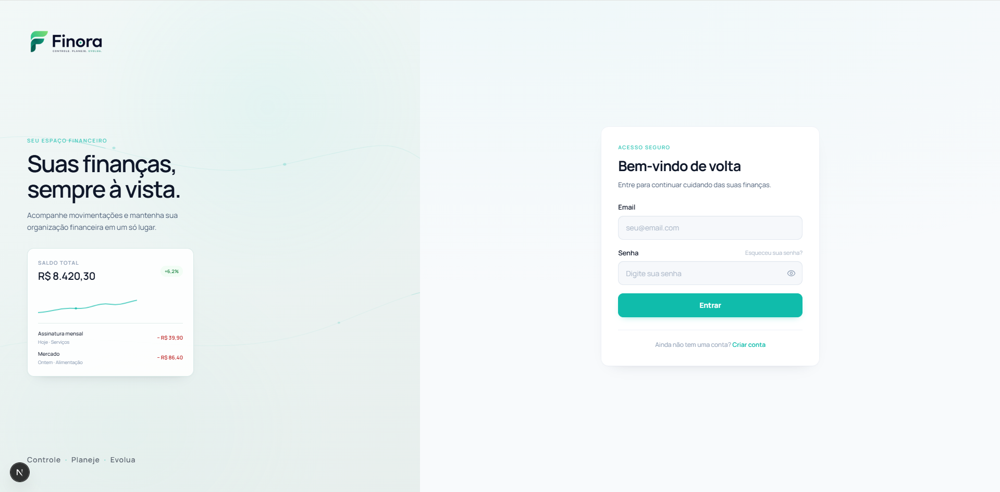
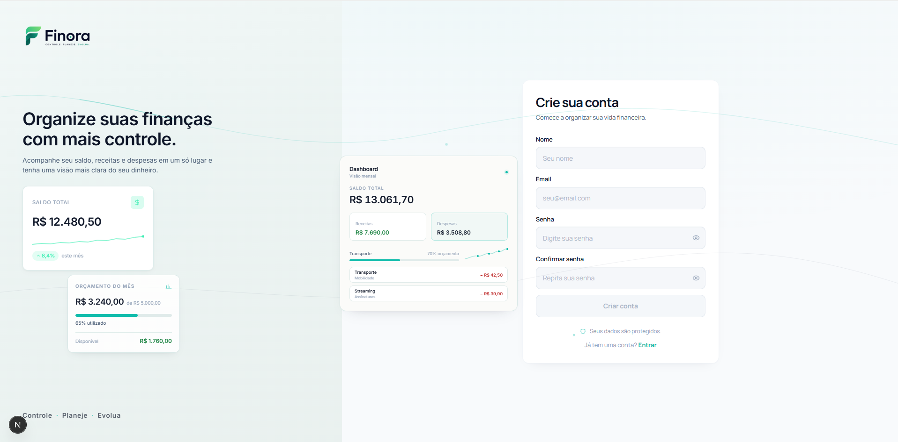

# Finora

**Controle. Planeje. Evolua.**

Aplicação full-stack de controle financeiro pessoal desenvolvida com **Next.js, React, TypeScript, PostgreSQL e Prisma**, com arquitetura preparada para múltiplas instituições financeiras, transações sincronizadas e categorização automática.

`Next.js 15` · `React 19` · `TypeScript` · `PostgreSQL` · `Prisma 6` · `Auth.js` · `LLMs`

> 🚧 **Em desenvolvimento ativo.** Este é o portfólio técnico público do Finora. O código-fonte principal permanece em repositório privado.

## Interface

A interface está sendo desenvolvida progressivamente, com foco em clareza, responsividade e identidade visual própria. As telas abaixo já passaram pela etapa atual de revisão visual.

### Login



A experiência de autenticação combina apresentação do produto e acesso à conta em uma interface responsiva alinhada à identidade visual do Finora.

### Cadastro



O cadastro combina o formulário principal com elementos que antecipam a experiência financeira do produto, mantendo hierarquia e clareza.

> Dashboard, Contas e Transações já estão funcionalmente implementados, mas suas interfaces ainda passarão por novas etapas de design antes de serem apresentadas visualmente neste portfólio.

## O projeto em poucos pontos

- **Dados reais no domínio:** Dashboard, Contas e Transações compartilham os mesmos services financeiros.
- **Fundação multibanco:** contas `MANUAL` e `CONNECTED`, transações `MANUAL` e `SYNCED`, normalização, ingestão e idempotência.
- **Automação controlada:** categorização manual e regras determinísticas sem alterar o fato financeiro original.
- **Engenharia com múltiplas LLMs:** modelos diferentes são usados em planejamento, implementação, revisão e auditoria dentro de um processo de validação técnica.

## Funcionalidades implementadas

### Autenticação e segurança

- Cadastro de usuários
- Login com Auth.js
- Hash de senha com bcrypt
- Verificação de e-mail por código de 6 dígitos
- Expiração e limite de tentativas do código
- Reenvio com cooldown
- Rate limiting
- Proteção contra enumeração no fluxo de verificação
- Sessão autenticada e proteção de rotas
- Isolamento de dados por usuário

### Dashboard

O Dashboard utiliza dados financeiros reais do usuário autenticado e apresenta:

- saldo total consolidado;
- receitas e despesas do período;
- resultado financeiro;
- gastos por categoria;
- gastos por conta;
- transações recentes;
- seleção de período.

### Contas

- Cadastro e visualização de contas
- Saldo individual e consolidado
- Contas `MANUAL` e `CONNECTED`
- Diferentes tipos de conta
- Saldo derivado das movimentações financeiras

### Transações

- Transações `MANUAL` e `SYNCED`
- Receitas e despesas
- Filtros, busca, ordenação e paginação
- Agrupamento por data
- Conta, categoria, método de pagamento, instituição e origem
- Criação de transações manuais

### Categorização

O Finora possui categorização manual e uma primeira camada de automação baseada em regras determinísticas.

```text
Descrição contém "UBER"
        ↓
Categoria Transporte
```

As regras pertencem ao usuário, possuem prioridade determinística e não alteram valor, natureza, conta ou identidade bancária da movimentação. Uma categoria já definida pelo usuário não é sobrescrita automaticamente.

Atualmente, a categorização automática **não utiliza IA**.

## Arquitetura multibanco

A fundação multibanco separa dados cadastrados manualmente de dados originados por integrações financeiras:

```text
Contas:      MANUAL | CONNECTED
Transações:  MANUAL | SYNCED
```

O pipeline segue a ideia:

```text
Provider
   ↓
Adapter
   ↓
Normalização
   ↓
Ingestão
   ↓
Prisma
   ↓
Domínio financeiro
   ↓
Dashboard / Contas / Transações
```

Uma sandbox bancária foi criada para validar instituições, conexões, contas externas, movimentações e reexecução de sincronizações sem duplicidade.

Entre os cenários já validados estão Pix recebido, Pix enviado, boleto, transferência bancária, preservação de categorização após resync e cálculo de saldo usando o mesmo domínio das contas manuais.

> Nenhum banco real ou integração Open Finance está conectado atualmente.

Mais detalhes em [`docs/architecture.md`](docs/architecture.md).

## Desenvolvimento com LLMs

O Finora também é um ambiente de experimentação com **Large Language Models (LLMs)** aplicados a um processo real de engenharia de software.

### Modelos e ecossistemas experimentados

- OpenAI GPT / ChatGPT
- Anthropic Claude
- NVIDIA Nemotron
- MiMo

### Ferramentas de apoio

- OpenAI Codex CLI
- Claude Code
- OpenCode
- OmniRoute
- Model Context Protocol (MCP)

As ferramentas acima não são tratadas como LLMs; elas fazem parte da infraestrutura usada para interagir, executar ou orquestrar os modelos.

O ciclo adotado no desenvolvimento é:

```text
planejar → implementar → auditar → corrigir → validar
```

Código sugerido por uma LLM não é considerado concluído apenas porque foi gerado. Dependendo da alteração, o processo inclui typecheck, lint, validação do Prisma, revisão de migrations, testes de regras de negócio, idempotência, ownership, segurança, inspeção visual e validação manual no navegador.

O objetivo da abordagem multi-modelo é observar como diferentes LLMs se comportam em tarefas reais de engenharia, sem depender de um único modelo para todas as etapas.

Mais detalhes em [`docs/llm-development.md`](docs/llm-development.md).

## Stack

### Frontend

- **Next.js 15**
- **React 19**
- **TypeScript**
- **Tailwind CSS 3**
- **React Hook Form**
- **Zod**
- **Radix UI**

### Backend e dados

- **Next.js App Router**
- **Auth.js / NextAuth 5**
- **Prisma 6**
- **PostgreSQL**
- **bcryptjs**
- **Resend** — infraestrutura de e-mail preparada para o fluxo de verificação

### Qualidade e validação

- TypeScript strict
- ESLint
- Prisma validation
- migrations versionadas
- validações de domínio
- testes de idempotência
- auditorias de segurança
- inspeção visual e testes manuais de fluxo

## Princípios de engenharia

Algumas invariantes importantes orientam o desenvolvimento:

- categorização não altera o fato financeiro;
- sincronização repetida não deve duplicar movimentações;
- ownership é validado no servidor;
- o cliente não controla `userId` nem campos de integração bancária;
- decisões manuais do usuário prevalecem sobre automações;
- dados de sandbox e fixtures são restritos ao desenvolvimento;
- integrações externas passam por normalização antes de chegar ao domínio;
- uma falha de enriquecimento não deve impedir a persistência do fato financeiro.

## Roadmap

Próximas etapas planejadas:

- módulo de transferências;
- orçamentos;
- relatórios financeiros;
- cartões e ciclo de faturas;
- reconciliação entre contas próprias;
- integração com provider financeiro real / Open Finance;
- sincronização automática via jobs e webhooks;
- categorização avançada;
- futuras funcionalidades de IA para sugestões e insights;
- hardening para produção distribuída.

Mais detalhes em [`docs/roadmap.md`](docs/roadmap.md).

## Status atual

O checkpoint atual cobre:

**autenticação → Dashboard → contas → transações → fundação multibanco → sandbox bancária → categorização manual → regras automáticas determinísticas**

A próxima fase funcional planejada é o módulo de **Transferências**.

## Código-fonte e licença

O código-fonte principal do Finora é mantido em **repositório privado**. Este repositório público existe para demonstração técnica, documentação e avaliação em contexto de portfólio e recrutamento.

Isso permite apresentar decisões de produto, arquitetura e engenharia sem publicar integralmente a implementação de um produto com potencial de exploração comercial.

Este repositório é disponibilizado apenas para fins de portfólio, demonstração e avaliação. Consulte [`LICENSE`](LICENSE) para os termos de uso.
